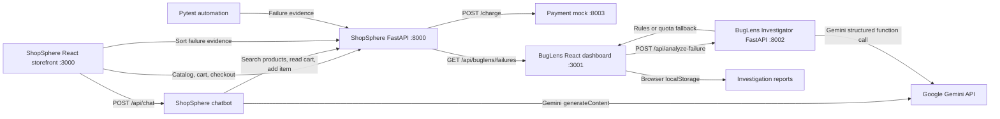

# BugLens and ShopSphere Architecture

## Overview

This repository contains two applications and their supporting APIs:

- **ShopSphere** is a sample e-commerce storefront and QA target.
- **BugLens** is a test-failure investigation dashboard backed by a separate AI Investigator API.

Both AI features use Gemini through REST API calls. The ShopSphere chatbot handles shopping questions and cart actions; the BugLens Investigator produces structured failure reports. Each falls back differently when Gemini is unavailable.

## Service Diagram



## Services

| Service | Technology | Port | Responsibility |
| --- | --- | ---: | --- |
| ShopSphere storefront | React 18, TypeScript, Vite, Lucide React | 3000 | Product catalog, search, filters, sorting, cart, checkout, shopping assistant UI |
| ShopSphere API | Python, FastAPI, Pydantic, Uvicorn | 8000 | Catalog/cart/checkout APIs, chatbot endpoint, QA evidence ingestion, source ZIP export |
| Payment mock | Python, FastAPI, Uvicorn | 8003 | Simulates payment charges; coupon requests fail intermittently for testing |
| BugLens dashboard | React 18, TypeScript, Vite, Lucide React | 3001 | Failure intake/import, investigation views, JSON report export, ShopSphere source export |
| BugLens Investigator | Python, FastAPI, Pydantic, standard-library HTTP client | 8002 | Gemini-backed analysis and rules-based fallback returning the dashboard report schema |

## Request Flows

### ShopSphere shopping assistant

1. The shopper enters a message in the storefront chat panel.
2. The browser posts the conversation to `POST /api/chat` on the ShopSphere API.
3. The backend sends the request to Gemini's `generateContent` endpoint with product-search, cart-read, and add-to-cart tools.
4. Tool calls are executed against the server-side ShopSphere catalog and cart, then returned to Gemini for a customer-facing reply.
5. If Gemini quota is exhausted, the backend returns a catalog/cart-only response and does not retry the 429 request.

The Gemini key stays on the backend. It is read from `GEMINI_API_KEY`; `GEMINI_MODEL` selects the model.

### BugLens investigation

1. A user creates a report in the dashboard or imports a failure from ShopSphere's `GET /api/buglens/failures` endpoint.
2. The dashboard submits each failure to `POST /api/analyze-failure` on the Investigator.
3. With `GEMINI_API_KEY`, the Investigator requests the full report through Gemini function calling and validates the returned object against its Pydantic model.
4. Without a key, it uses deterministic evidence rules and sets `RULE_BASED_FALLBACK`.
5. If Gemini returns HTTP 429, the Investigator uses the rules fallback, adds `GEMINI_QUOTA_FALLBACK`, and requires human review.
6. The dashboard stores the returned report in browser `localStorage` and displays it in the investigation list/detail view.

## Repository Layout

```text
apps/
  dashboard/
    src/App.tsx            Dashboard UI and API client
    src/investigator.ts    Empty intake-form defaults
    src/types.ts           Shared report and evidence types
  shopsphere/
    frontend/
      src/App.tsx          Storefront, catalog, cart, chat UI
      src/styles.css       Storefront styling
    backend/
      main.py              Product, cart, checkout, chat, evidence, export APIs
      chatbot.py           Gemini shopping assistant and catalog/cart tools
      requirements.txt     Shop API dependencies
      myenv/               Local Python virtual environment (git-ignored)
    payment-mock/
      main.py              Simulated payment provider
ai/
  investigator/
    main.py                Gemini Investigator, schema, and rules fallback
    requirements.txt       Investigator API dependencies
    Dockerfile             Investigator container
automation/
  tests/
    test_shopsphere.py     ShopSphere regression tests
    test_investigator.py   Gemini report/quota fallback tests
docker-compose.yml         Five-service integrated stack
TECH_STACK.md              Stack and setup guide
ARCHITECTURE.md            This architecture overview
```

## Runtime Configuration

The root `docker-compose.yml` builds and connects all five services. Host ports match the table above. Inside Compose, the ShopSphere API reaches the payment mock at `http://payment-mock:8003`; browsers reach APIs at `localhost`.

Set these optional values in the root `.env` file or the shell that starts the relevant service:

```env
GEMINI_API_KEY=
GEMINI_MODEL=gemini-3.8-flash
COUPON_FAILURE_RATE=0.6
```

Without a Gemini key, the Investigator runs in rules-demo mode. The ShopSphere chatbot instead returns HTTP 503 indicating that chat is not configured. The local `apps/shopsphere/.env` file is ignored by Git and is not automatically loaded by root Compose; when using the full root Compose stack, provide the key through the root `.env` or process environment.

## Persistence and QA Boundaries

- ShopSphere cart, orders, and newly captured failures live in API process memory and reset when that API restarts.
- ShopSphere also exposes four starter QA scenarios from `/api/buglens/failures`.
- BugLens reports persist in browser `localStorage`; there is no report database yet.
- Payment is simulated and must not be used for real transactions.
- Intentional QA defects include incorrect cart subtotal, intermittent coupon charge failure, cart clearing after failed payment, and reversed low-to-high product sorting.
- Pytest regression tests assert the correct behavior, so they are expected to fail while the intentional backend defects remain. Failed tests are posted to ShopSphere when its API is running.

## Useful Endpoints

| Endpoint | Purpose |
| --- | --- |
| `GET /api/health` on port 8000 | ShopSphere API health |
| `GET /api/products` on port 8000 | Product catalog |
| `GET /api/cart` on port 8000 | Current cart |
| `POST /api/checkout` on port 8000 | Simulated checkout |
| `POST /api/chat` on port 8000 | Gemini shopping assistant |
| `GET /api/buglens/failures` on port 8000 | Starter and captured failure evidence |
| `POST /api/buglens/failures` on port 8000 | Capture test or frontend failures |
| `GET /api/export` on port 8000 | Download standalone ShopSphere source ZIP |
| `GET /api/health` on port 8002 | Investigator health and mode |
| `POST /api/analyze-failure` on port 8002 | Return a structured BugLens investigation report |
