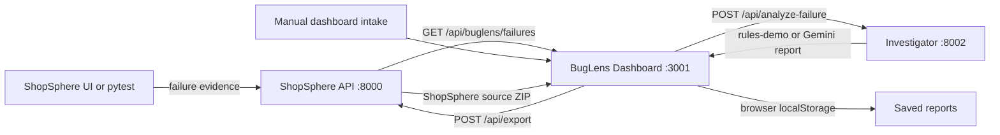

# BugLens and ShopSphere Tech Stack

## At a glance

The repository contains a ShopSphere sample storefront, its API and payment simulator, the BugLens dashboard, and a separate investigator API. The investigator uses deterministic rules when no Gemini key is configured and Gemini for structured reports when a key is available.

| Service | Technology | Local port | Main responsibility |
| --- | --- | ---: | --- |
| ShopSphere storefront | React 18, TypeScript, Vite, Lucide React | 3000 | Product catalog, search/filter/sort, cart, simulated checkout |
| ShopSphere API | Python, FastAPI, Pydantic, Uvicorn | 8000 | Catalog/cart/checkout APIs, failure ingestion, ShopSphere ZIP export |
| Payment mock | Python, FastAPI, Uvicorn | 8003 | Simulated charges; coupon requests fail intermittently by design |
| BugLens dashboard | React 18, TypeScript, Vite, Lucide React | 3001 | Failure intake/import, investigation list/detail, JSON report export |
| BugLens Investigator | Python, FastAPI, Pydantic, Gemini REST API | 8002 | Evidence-based fallback or Gemini-generated structured investigation reports |
| QA automation | pytest, FastAPI TestClient/httpx | N/A | Regression checks and automatic failure submission to ShopSphere |

## How a report is created



When importing ShopSphere failures, the dashboard fetches the ShopSphere evidence feed and submits each failure to the Investigator API. New manual investigations use the same Investigator endpoint. The report returned by that API is validated against the dashboard's structured report model.

## Frontend setup

The two frontend applications use the same base stack: React and React DOM 18, TypeScript, Vite, and Lucide React icons. Styles are application-local CSS. Vite serves the ShopSphere storefront on port `3000` and BugLens on port `3001`.

Each frontend has its own `package.json`, lockfile/configuration, and Dockerfile. Install and run either app from its directory:

```powershell
cd apps/shopsphere/frontend
npm install
npm run dev
```

```powershell
cd apps/dashboard
npm install
npm run dev
```

To create a production bundle, run `npm run build` from the corresponding frontend directory. The dashboard's `VITE_SHOPSPHERE_API` and `VITE_ANALYSIS_API` values are Vite build-time settings. Their local defaults are `http://localhost:8000` and `http://localhost:8002`.

## Python service setup

Python services use FastAPI for HTTP routes and OpenAPI docs, Pydantic for request/response validation, and Uvicorn as the ASGI server. Each service has a `requirements.txt` and Dockerfile. ShopSphere's backend virtual environment is ignored by Git at `apps/shopsphere/backend/myenv/`.

From the repository root, activate that environment before running a service:

```powershell
.\apps\shopsphere\backend\myenv\Scripts\Activate.ps1
```

Install the service requirements, then run Uvicorn from that service's folder:

```powershell
pip install -r apps/shopsphere/backend/requirements.txt
cd apps/shopsphere/backend
uvicorn main:app --reload --port 8000
```

For the payment simulator, open another terminal, activate the same environment, install its requirements, and start the service:

```powershell
.\apps\shopsphere\backend\myenv\Scripts\Activate.ps1
pip install -r apps/shopsphere/payment-mock/requirements.txt
cd apps/shopsphere/payment-mock
uvicorn main:app --reload --port 8003
```

For the Investigator, open another terminal and activate the same environment. It uses Python's standard-library HTTP client for Gemini, so no separate AI SDK is needed:

```powershell
.\apps\shopsphere\backend\myenv\Scripts\Activate.ps1
pip install -r ai/investigator/requirements.txt
cd ai/investigator
uvicorn main:app --reload --port 8002
```

The service docs are at `/docs` on ports `8000` and `8002`.

## Investigator modes

`GET http://localhost:8002/api/health` reports service status and mode. The mode is `rules-demo` when `GEMINI_API_KEY` is absent and `gemini` when it is present. In rules-demo mode, reports include the `RULE_BASED_FALLBACK` flag. Gemini quota exhaustion uses the rule fallback, adds `GEMINI_QUOTA_FALLBACK`, and requires human review.

To enable Gemini, set `GEMINI_API_KEY` in the environment that launches the Investigator. `GEMINI_MODEL` is optional and defaults to `gemini-3.8-flash`. The agent forces a structured function call and validates the response against the dashboard report model. It treats supplied evidence as data, asks for one likely root cause, and forces human review for confidence below `0.70`.

The analysis endpoint is `POST /api/analyze-failure`. Its input is the test context and available failure evidence; its output is the complete investigation report, including classification, severity, confidence, evidence usage, remediation, metadata, and ML-ready fields.

## Docker Compose setup

The root `docker-compose.yml` builds and runs all five services. From the repository root, with Docker Desktop running:

```powershell
docker compose up --build
```

Compose maps the five container ports to the same host ports listed above. It configures the backend to reach the payment mock by its Compose service name, adds health checks for the APIs, and waits for the ShopSphere API and Investigator health checks before starting the dependent frontends.

Optional root `.env` values:

```env
GEMINI_API_KEY=
GEMINI_MODEL=gemini-3.8-flash
COUPON_FAILURE_RATE=0.6
```

Omitting the API key is valid and leaves the Investigator in rules-demo mode. To stop the stack, press Ctrl+C in the Compose terminal or run `docker compose down` from the repository root.

ShopSphere can also be exported independently from the dashboard. Its downloaded archive contains `apps/shopsphere/docker-compose.yml` as the extracted project-root Compose file, so that archive starts the storefront, API, and payment mock without the BugLens dashboard or Investigator.

## Failure targets and QA

ShopSphere includes deliberate failure targets used to exercise the reporting flow:

1. Cart subtotal omits item quantity.
2. Coupon charges fail intermittently in the payment mock; `COUPON_FAILURE_RATE` controls the default 60% rate.
3. Failed payment clears the cart and leaves the order pending.
4. The storefront's “Price: low to high” option sorts high to low and sends evidence to the ShopSphere API.

Pytest checks the backend and payment scenarios in `automation/tests/test_shopsphere.py`. Those regression tests assert correct behavior, so failures are expected until the defects are fixed. `automation/conftest.py` attempts to submit test-failure evidence to the ShopSphere API while it is running.

Install QA requirements and run the tests:

```powershell
.\apps\shopsphere\backend\myenv\Scripts\Activate.ps1
pip install -r automation/requirements.txt
pytest automation/tests/test_shopsphere.py -v
```

## Current data and persistence

- ShopSphere's cart, orders, and newly captured failures are held in API process memory. They reset when the API restarts.
- The ShopSphere failure endpoint also supplies starter QA scenarios for import; the dashboard itself no longer inserts seeded reports.
- BugLens reports are saved in browser `localStorage`, not in a server database. Clearing browser storage removes those reports.
- ShopSphere's source-export endpoint constructs a ZIP from an explicit source-file allowlist; it does not include dependencies or build output.
- Payments are simulated. Do not use the prototype to process real payments or personal data.

## Useful endpoints

| Endpoint | Purpose |
| --- | --- |
| `GET /api/health` on port `8000` | ShopSphere API health |
| `GET /api/products` on port `8000` | Product catalog |
| `GET /api/cart` on port `8000` | Current in-memory cart |
| `POST /api/checkout` on port `8000` | Simulated checkout |
| `GET /api/buglens/failures` on port `8000` | Starter and captured ShopSphere failure evidence |
| `POST /api/buglens/failures` on port `8000` | Capture a frontend or test failure |
| `GET /api/export` on port `8000` | Download a standalone ShopSphere source archive |
| `GET /api/health` on port `8002` | Investigator health and operating mode |
| `POST /api/analyze-failure` on port `8002` | Generate a structured report |
